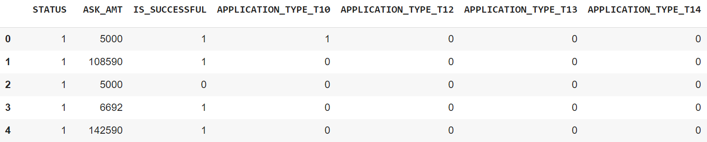
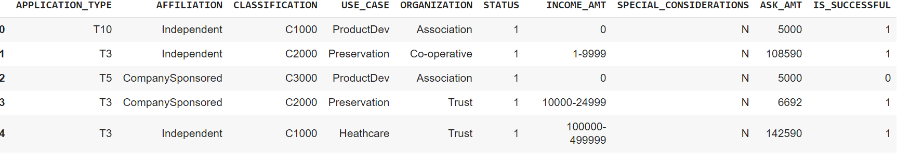

# Deep_Learning_Challenge

The report should contain the following:

1. **Overview** Purpose of Running the Analysis Model.

The nonprofit foundation Alphabet Soup wants a tool that can help it select the applicants for funding with the best chance of success in their business ventures. In other words Alphabet Soup wants funding to go where there is a high chance of business success. Deep Machine Learning is a tool that my hep unravel all the potential success factors regarding client funding selction and prediciting the associated business ventures success rates.

2. **Results**: Using bulleted lists and images to support your answers, address the following questions:

  (i) Alphabet Soup Foundation classifies customers into various application types from T1 to T17 with most customers falling within T3:
index	APPLICATION_TYPE
0	T3	27037
1	T4	1542
2	T6	1216
3	T5	1173
4	T19	1065
5	T8	737
6	T7	725
7	T10	528
8	T9	156
9	T13	66
10	T12	27
11	T2	16
12	T25	3
13	T14	3
14	T29	2
15	T15	2
16	T17	1

(ii) Loan were further classified with class C1000 haveing the highest loan applications at 17326
index	CLASSIFICATION
0	C1000	17326
1	C2000	6074
2	C1200	4837
3	C3000	1918
4	C2100	1883
5	C7000	777
6	C1700	287
7	C4000	194
8	C5000	116
9	C1270	114
10	C2700	104
11	C2800	95
12	C7100	75
13	C1300	58
14	C1280	50
15	C1230	36
16	C1400	34
17	C7200	32
18	C2300	32
19	C1240	30
20	C8000	20
21	C7120	18
22	C1500	16
23	C1800	15
24	C6000	15
25	C1250	14
26	C8200	11
27	C1238	10
28	C1278	10
29	C1235	9
30	C1237	9
31	C7210	7
32	C2400	6
33	C1720	6
34	C4100	6
35	C1257	5
36	C1600	5
37	C1260	3
38	C2710	3
39	C0	3
40	C3200	2
41	C1234	2
42	C1246	2
43	C1267	2
44	C1256	2

(iii) The loan types are then ranked by their success rate see the excerpt below on part of the data:

* Data Preprocessing
  * What variable(s) are the target(s) for your model?

 (i) The variables as targets for the model are loan types, loan classes,use case,income,ask amount and success rate: 

  * What variable(s) are the features for your model?

  (i) The features focus on Loan Success Rate

  * What variable(s) should be removed from the input data because they are neither targets nor features?
  (i) Loan classes can be be removed from input data because loan types should be good enough to run the model.

* Compiling, Training, and Evaluating the Model
  * How many neurons, layers, and activation functions did you select for your neural network model, and why?
  (i)I used 120 and 90 for layers 1 and 2 respectively. The lower the numbers the less chances of over analysis paralysis

  * Were you able to achieve the target model performance?
  (i) Model Accuracy and Loss were 0.7295 & 0.5534 respectively. (rounded off)
  * What steps did you take in your attempts to increase model performance?
(i) Model Performance is driven by training the model by increasing the Epochs from 100 t0 150 improved the Accuracy and increased the Loss to 0.7262 & 0.5546 respectively versus 0.7295 & 0.5535 at 100 Epochs. At 300 Epochs the loss: 0.5627 & accuracy: 0.7276 very marginal changes
3. **Summary**: Summarize the overall results of the deep learning model. Include a recommendation for how a different model could solve this classification problem, and then explain your recommendation.

In conculision the deep learning model can be optimized by increasing the number of epochs and chnaging the layers & neurons to increase or reduce the depth of analysis. 

In the target model by changing the number of Epochs from 100 to 300 there are marginal changes in the loss and accuracy ratios. Also by increasing the number of layers for layer 1 and 2 to 200 & 150 from 120 and 90 respectively changed the loss and accuracy marginally to 0.5596 & 0.7295 respectively.